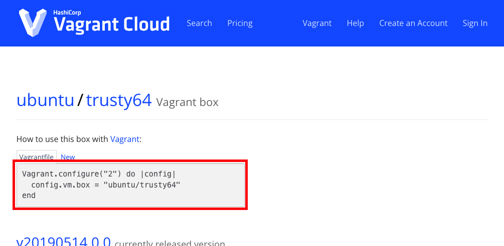
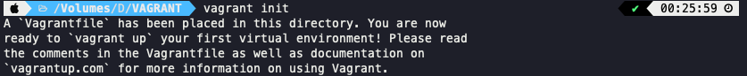

# Vagrant 를 이용하여 VM 제어하기

## Vagrant 동작
- Box 이미지 다운로드 -> Box 이미지를 이용하여 프로젝트 생성(가상환경, 가상머신을 구축)
  * 운영체제 이미지를 다운로드 받아야함
  * 이미지 : 운영체제가 필요한 실행파일이라던가 라이브러리, 바이너리 파일 같은 것들을 하나로 압축해서 단일 파일로 만들어서 배포할 때 사용되는 것
  * 박스 이미지 : 운영체제가 압축되어서 다운로드 될 수 있는 형태로 배포되는 것
- 프로젝트 최상위 디렉토리에 Vagrantfile 파일 생성/수정
  * 생성사려고 하는 가상 머신의 어떤 환경이라던가 리소스의 상태라던가 서버가 가지고 있어야 할 설정 파일이라던가 이런 것들을 지정
- 프로젝트를 위한 vagrant 가상 인스턴스(vm)시작
- 가상 인스턴스 접속 및 작업
  * 서버에 우리가 접속하기 위한 방법으로서 SSH 를 사용하게 된다.
  * 접속하고자 하는 대상이 되는 쪽에서는 SSH 서버가 기동이 되어 있어야 되며,
  * 접속을 시도하려고 하는 쪽에서는 SSH 클라이언트가 준비가 되어 있어야 된다.(Win; 명령 프롬프트, cmd)(Mac; 터미널)
- 가상 인스턴스 종료

## Box 이미지
- [Box command line interface doc](https://developer.hashicorp.com/vagrant/docs/boxes)
- [Box 파일 조회](https://app.vagrantup.com/boxes/search)


## Box 이미지 cloud 에서 다운로드 & 인스턴스 생성

```bash
# 작업 디렉토리에서
$ vagrant init
```
- 
```bash
# init 예시; generic/ubuntu1804
$ vagrant init generic/ubuntu1804
```
```bash
# log
A `Vagrantfile` has been placed in this directory. You are now
ready to `vagrant up` your first virtual environment! Please read
the comments in the Vagrantfile as well as documentation on
`vagrantup.com` for more information on using Vagrant.
```
```bash
# up 예시; generic/ubuntu1804
$ vagrant up
```
```bash
# log
Bringing machine 'default' up with 'virtualbox' provider...
==> default: Importing base box 'generic/ubuntu1804'...
==> default: Matching MAC address for NAT networking...
==> default: Checking if box 'generic/ubuntu1804' version '4.3.2' is up to date...
==> default: Setting the name of the VM: VAGRANT_default_1698108102686_54644
==> default: Clearing any previously set network interfaces...
==> default: Preparing network interfaces based on configuration...
    default: Adapter 1: nat
==> default: Forwarding ports...
    default: 22 (guest) => 2222 (host) (adapter 1)
==> default: Running 'pre-boot' VM customizations...
==> default: Booting VM...
==> default: Waiting for machine to boot. This may take a few minutes...
    default: SSH address: 127.0.0.1:2222
    default: SSH username: vagrant
    default: SSH auth method: private key
    default:
    default: Vagrant insecure key detected. Vagrant will automatically replace
    default: this with a newly generated keypair for better security.
    default:
    default: Inserting generated public key within guest...
    default: Removing insecure key from the guest if it's present...
    default: Key inserted! Disconnecting and reconnecting using new SSH key...
==> default: Machine booted and ready!
==> default: Checking for guest additions in VM...
    default: The guest additions on this VM do not match the installed version of
    default: VirtualBox! In most cases this is fine, but in rare cases it can
    default: prevent things such as shared folders from working properly. If you see
    default: shared folder errors, please make sure the guest additions within the
    default: virtual machine match the version of VirtualBox you have installed on
    default: your host and reload your VM.
    default:
    default: Guest Additions Version: 5.2.42
    default: VirtualBox Version: 7.0
```
```bash
$ vagrant global-status
```
```bash
# log
id       name    provider   state   directory
------------------------------------------------------------------------
08ba251  default virtualbox running /Volumes/D/VAGRANT

The above shows information about all known Vagrant environments
on this machine. This data is cached and may not be completely
up-to-date (use "vagrant global-status --prune" to prune invalid
entries). To interact with any of the machines, you can go to that
directory and run Vagrant, or you can use the ID directly with
Vagrant commands from any directory. For example:
"vagrant destroy 1a2b3c4d"
```
```bash
$ vagrant global-status
id       name    provider   state   directory
------------------------------------------------------------------------
08ba251  default virtualbox running /Volumes/D/VAGRANT

The above shows information about all known Vagrant environments
on this machine. This data is cached and may not be completely
up-to-date (use "vagrant global-status --prune" to prune invalid
entries). To interact with any of the machines, you can go to that
directory and run Vagrant, or you can use the ID directly with
Vagrant commands from any directory. For example:
"vagrant destroy 1a2b3c4d"
```
```bash
# vagrant ssh [instance-name]; (instance name : vagrant global-status name)
$ vagrant ssh default
```
```bash
vagrant@ubuntu1804:~$ ll -arlth
total 36K
drwxr-xr-x 3 root    root    4.0K Sep 23 23:29 ../
-rw-r--r-- 1 vagrant vagrant  807 Sep 23 23:29 .profile
-rw-r--r-- 1 vagrant vagrant  220 Sep 23 23:29 .bash_logout
-rw-r--r-- 1 vagrant vagrant 3.7K Sep 23 23:55 .bashrc
-rw-r--r-- 1 vagrant vagrant   13 Sep 23 23:55 .vimrc
drwxr-xr-x 2 vagrant vagrant 4.0K Sep 23 23:55 .cache/
drwx------ 3 vagrant vagrant 4.0K Oct 24 00:42 .gnupg/
drwxr-xr-x 5 vagrant vagrant 4.0K Oct 24 00:42 ./
drwx------ 2 vagrant vagrant 4.0K Oct 24 00:42 .ssh/
vagrant@ubuntu1804:~$
```
## Vagrantfile
- ruby 언어로 작성 된 Vagrant 설정 스크립트
- Vagrant 인스턴스로 생성 될 내용(설정)등의 내용을 작성
- vagrant init 명령어 실행 시 기본 Vagrantfile 생성

## 주요 command
```bash
$ vagrant v
$ vagrant status
$ vagrant global-status #
$ vagrant init      # Provisioning 하는 스크립트(Vagrantfile) 생성 
$ vagrant up        # Vagrantfile 을 읽어 Provisioning 진행
$ vagrant halt      # Host 종료
$ vagrant destory   # Host 삭제
$ vagrant suspend   # Host 중지(종료랑 다름)
$ vagrant resumne
$ vagrant reload
$ vagrant ssh       # Host접속
#
$ vagrant provision # Host 설정 변경 적용
```
