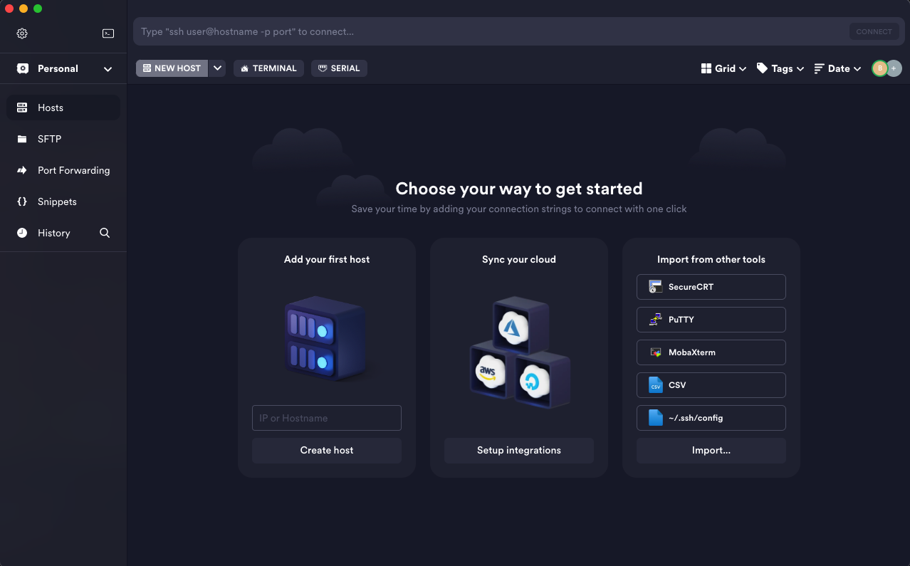
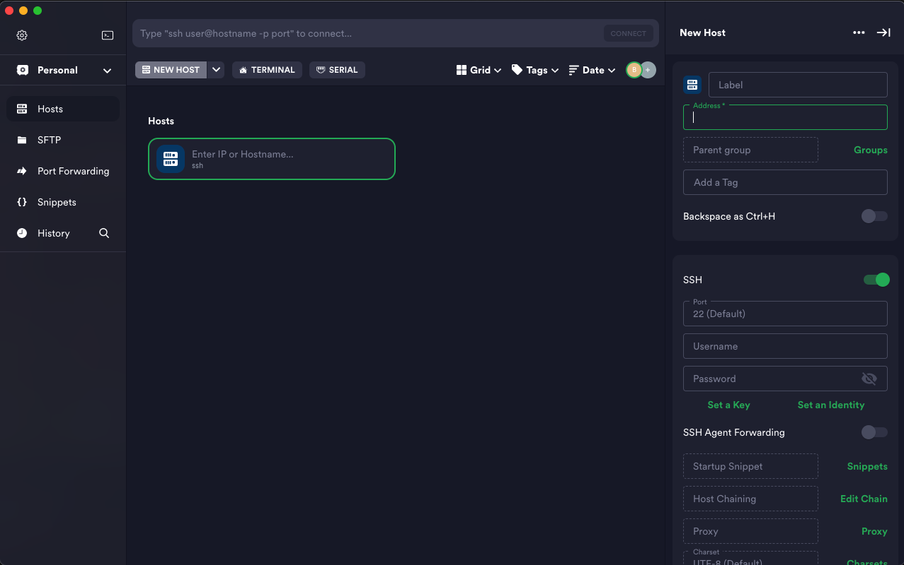
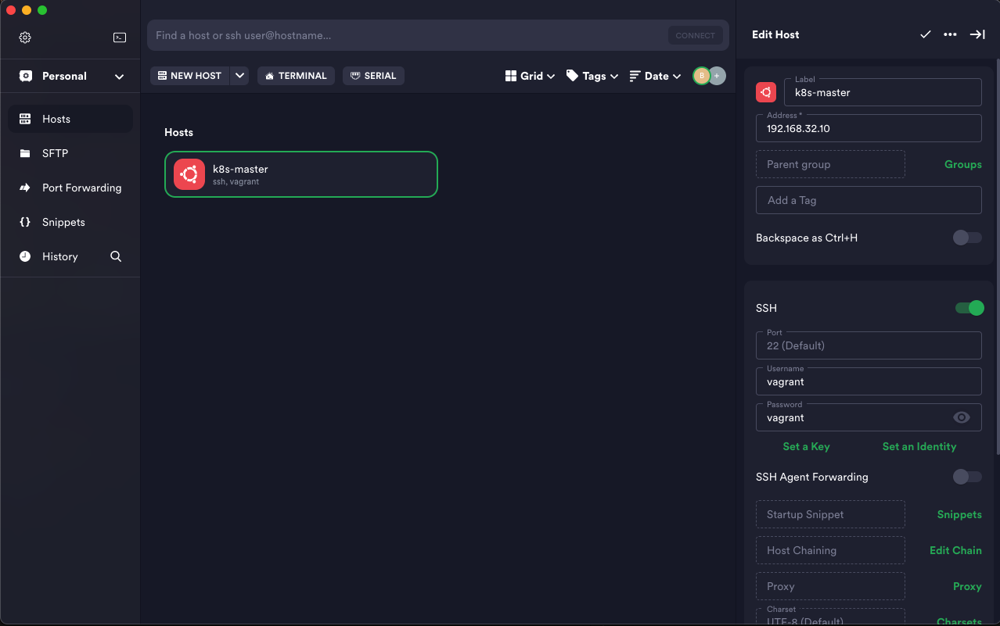
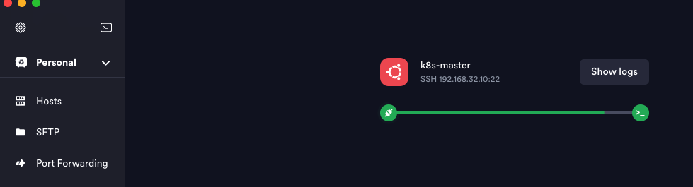
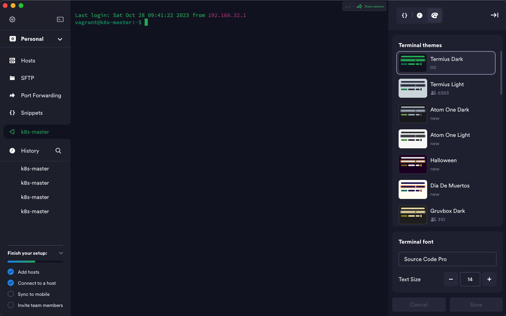
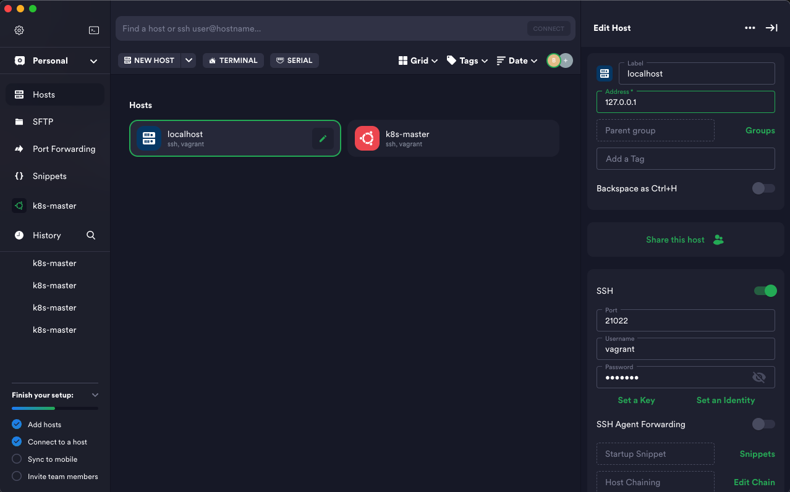
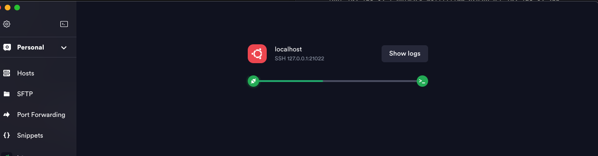

# VM 환경에 Docker Engine 설치

## SSH 클라이언트 설치
- [Termius](https://termius.com/)
- [Termius brew](https://formulae.brew.sh/cask/termius)
```bash
id: balete4342@wisnick.com 
pw: q~
``` 

## Multi instance 생성
### [예제](https://github.com/joneconsulting/vagrant)
  * [install](https://github.com/joneconsulting/vagrant/blob/main/install/01_ubuntu_k8s_install_newest.md)
  * [Vagrantfile](https://github.com/joneconsulting/vagrant/blob/main/scripts/Vagrantfile)
    * 위의 링크의 파일을 참조하여 Vagrantfile 수정
  * [sshd_config.sh](https://github.com/joneconsulting/vagrant/blob/main/scripts/sshd_config.sh)
      * 위의 링크의 파일을 참조하여 sshd_config.sh 추가
      * 리눅스에 ssh 서버를 설치하게 되면 id/pw를 입력하고 로그인할 수 있는 부분이 차단되어 있는데, 그 부분의 설정을 가능하게 하도록 바꿔주는 옵션과, 서버를 재시작 하는 script
      * 이 스크립트를 실행하지 않게 되면 서버에 접속한 후에 해당 설정을 수기로 바꿔줘야 한다.
### Vagrantfile update
```ruby
Vagrant_API_Version="2"

Vagrant.configure(Vagrant_API_Version) do |config|
  # Master
  config.vm.define:"k8s-master" do |cfg|
    cfg.vm.box = "generic/ubuntu2004"     # OS image
    cfg.vm.provider:virtualbox do |vb|    # Master node cpu, memory
        vb.name="K8s-Master"
        vb.cpus = 2
        vb.memory = 2048
    end
    cfg.vm.hostname = "k8s-master"        # name
    cfg.vm.synced_folder ".", "/vagrant"  # 가상머신 , host pc(가상머신을 올린 pc) 사이의 공유폴더 path 지정(파일전송 용이하게 하기 위해)
    cfg.vm.network "private_network", ip: "192.168.32.10" # ip addr
    cfg.vm.network "forwarded_port", guest: 22, host: 21022, auto_correct: false, id: "ssh" # port 지정, ssh guest(;vm) 22 <- host 21022
    cfg.vm.network "forwarded_port", guest: 80, host: 10080
    cfg.vm.network "forwarded_port", guest: 8000, host: 18000
    cfg.vm.network "forwarded_port", guest: 8001, host: 18001
    cfg.vm.network "forwarded_port", guest: 8080, host: 18080
    cfg.vm.provision "shell", path: "sshd_config.sh"      # sh file execute
  end
end
```
#### vagrant status 확인
```bash
$ vagrant status
# log
Current machine states:

k8s-master                running (virtualbox)
...
```
### vagrant up
```bash
$ vagrant up
```
```bash
# log
Bringing machine 'k8s-master' up with 'virtualbox' provider...
==> k8s-master: Importing base box 'generic/ubuntu2004'...
==> k8s-master: Matching MAC address for NAT networking...
==> k8s-master: Checking if box 'generic/ubuntu2004' version '3.1.16' is up to date...
==> k8s-master: A newer version of the box 'generic/ubuntu2004' for provider 'virtualbox' is
==> k8s-master: available! You currently have version '3.1.16'. The latest is version
==> k8s-master: '4.3.4'. Run `vagrant box update` to update.
==> k8s-master: Setting the name of the VM: K8s-Master
==> k8s-master: Clearing any previously set network interfaces...
==> k8s-master: Preparing network interfaces based on configuration...
    k8s-master: Adapter 1: nat
    k8s-master: Adapter 2: hostonly
==> k8s-master: Forwarding ports...
    k8s-master: 22 (guest) => 21022 (host) (adapter 1)
    k8s-master: 80 (guest) => 10080 (host) (adapter 1)
    k8s-master: 8000 (guest) => 18000 (host) (adapter 1)
    k8s-master: 8001 (guest) => 18001 (host) (adapter 1)
    k8s-master: 8080 (guest) => 18080 (host) (adapter 1)
........
```
### vagrant ssh 접속
#### use vagrant
```bash
$ vagrant ssh k8s-master
vagrant@k8s-master:~$ 
```
#### use termius: vm ip info





#### use termius: localhost ip info
 



### docker install to vm
#### 루트계정 유저로 로그인
```bash
vagrant@k8s-master:~$ sudo su - 
root@k8s-master:~#
```

#### root password 변경
```bash
$ passwd root 
New password:         #e.g. vagrant
Retype new password:
passwd: password updated successfully

```
#### [SWAP memory 비활성화 이유](https://kgw7401.tistory.com/50)
```bash
$ swapoff -a && sed -i '/swap/s/^/#/' /etc/fstab # SWAP 비활성화
```

#### 노드간 통신을 위한 Bridge 설정 (Iptables 커널 옵션 활성화)
```bash
$ cat <<EOF | sudo tee /etc/modules-load.d/k8s.conf
br_netfilter
EOF
cat <<EOF>>  /etc/sysctl.d/k8s.conf
net.bridge.bridge-nf-call-ip6tables = 1
net.bridge.bridge-nf-call-iptables = 1
EOF
```
```bash
$ sysctl --system
```

#### Hostname 변경(Vagrantfile에서 변경 됨), Hosts 파일 수정 --> 각 노드의 ipaddress에 맞게 수정, Hostname 변경하지 않으면 kubeadm join 시 오류 발생
```bash
$ hostname
$ ping k8s-master
```
```bash
$ vi /etc/hosts 
```

#### ip addr 대신 domain 으로 통신할 용도, domain 매핑 등록
```vi
192.168.32.10 k8s-master
192.168.32.11 k8s-node01
192.168.32.12 k8s-node02
```

#### 필수 패키지 설치
```bash
$ apt-get -y install ca-certificates curl gnupg net-tools
```

#### Docker GPG key 추가
* 위의 명령어는 Docker 패키지 저장소의 공식 GPG 키를 다운로드하고 시스템에 추가하는 것을 목적으로 실행.
* 이 키를 추가하면 시스템은 Docker 패키지를 신뢰하고, 이 패키지 저장소에서 Docker를 설치 및 업데이트할 때 인증을 수행할 목적으로 추가.
```bash
$ curl -fsSL https://download.docker.com/linux/ubuntu/gpg | sudo gpg --dearmor -o /usr/share/keyrings/docker-archive-keyring.gpg
```

#### Docker repository 등록
* 이 명령어는 Docker 패키지 저장소의 APT 저장소 설정을 생성하고 이 설정을 /etc/apt/sources.list.d/docker.list 파일에 저장을 목적으로 실행.
* 이후 시스템에서 APT를 사용하여 Docker를 설치 또는 업데이트할 때, Docker 패키지 저장소를 참조하여 필요한 패키지를 다운로드 한다.
```bash
$ echo \
  "deb [arch=$(dpkg --print-architecture) signed-by=/usr/share/keyrings/docker-archive-keyring.gpg] https://download.docker.com/linux/ubuntu \
  $(lsb_release -cs) stable" | sudo tee /etc/apt/sources.list.d/docker.list > /dev/null
```

#### Docker engine 설치 
```bash
$ apt-get update
$ apt-get install -y docker-ce docker-ce-cli containerd.io
```

#### Docker 버전 확인
```bash
$ docker version
```

#### dockeradmin 유저 생성
```bash
$ useradd dockeradmin
$ passwd dockeradmin
```
#### dockeradmin 그룹 생성
* docker 그룹에 dockeradmin 유저를 추가; docker 그룹에서만 docker service 를 사용하게 하는 목적
```bash
$ usermod -aG docker dockeradmin
```

#### docker compose 
* 이 명령어 그룹은 Docker Compose를 다운로드하고 실행 가능한 바이너리 파일로 설치하는 작업을 수행
```bash
$ curl -L "https://github.com/docker/compose/releases/download/1.24.1/docker-compose-$(uname -s)-$(uname -m)" -o /usr/local/bin/docker-compose
$ chmod +x /usr/local/bin/docker-compose
$ ln -s /usr/local/bin/docker-compose /usr/bin/docker-compose
$ docker-compose -version 
```
#### docker run test
```bash
$ docker pull nginx
$ docker run --name mynginx -d -p 80:80 nginx 
```