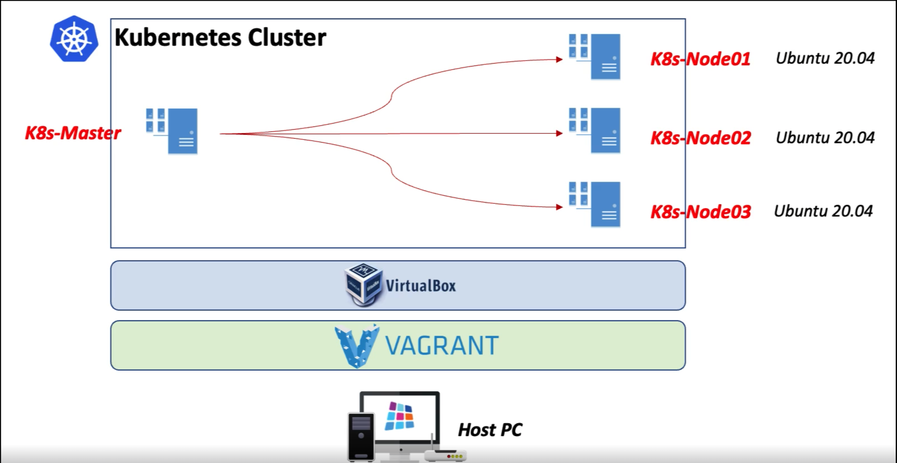

# Kubernetes Cluster 환경 구축
- [Kubernetes](https://kubernetes.io/)는
 [docker](https://www.docker.com/) 나
 [containerd](https://containerd.io/) 와 같은 컨테이너 가상화 엔진을 관리해주는 오케스트레이션 도구
  1. 가상화 컨테이너의 라이프사이클 관리
  2. 일정 관리
  3. 리소스 관리
- 위와 같은 관리적인 측면을 지원해주는 컨테이너 관리 플랫폼
- 이제까지 구축했던 VM 환경 내에서 Kubernetes 클러스터를 설치하고 구성하는 내용까지 살펴본다.

## 쿠버네티스 구성을 위한 node 구축
- 
- Termius 로 ssh 접속 
  - k8s-master,
  - k8s-node01,
  - k8s-node02
- Ubuntu 서버에 Kubernetes (Master + Worker) 설치

## docker config
- [docker config(docker install to vm)](../02_install-docker-engine-in-a-vm-environment/README.md)

## Kubernetes commands
```bash
kubectl get nodes # 현재 작업에 참여하고 있는 노드들의 목록, 어떤 역할 갖고 있는지 확인
kubectl get pods --all -namespaces # kubernetes 최소 관리단위가 pod인데, 이 관리단위의 목록을 노출
# 버전 확인
kubeadm version 
kubelet --version 
kubectl version
```

## Kubernetes cluster 설치
- kubernetes cluster 를 설치할 때는
  - 전체 워커 노드(해당 예제; k8s-node01, k8s-node02) 를 관리하기 위한
  - 컨트롤 플레인을 하나 만들어야 한다(해당 예제; k8s-master)

### Master, Worker 공통 설치 모듈(Control plane, Worker node)
- kubeadm, kubelet, kubectl 설치 및 활성화
```bash
apt-get install -y apt-transport-https ca-certificates curl
```
- Key 추가 및 apt udpate
```bash
curl -s https://packages.cloud.google.com/apt/doc/apt-key.gpg | sudo apt-key add -
cat <<EOF | sudo tee /etc/apt/sources.list.d/kubernetes.list
deb https://apt.kubernetes.io/ kubernetes-xenial main
EOF
```
```bash
apt-get update 
```
- 최신 버전 설치 (2023-06-07 기준 1.27 버전)
```bash
apt-get install -y kubelet kubeadm kubectl
```
- 버전 확인
```bash
kubeadm version
kubelet --version
kubectl version
```
- 최신 버전 업데이트 방지
```bash
apt-mark hold kubelet kubeadm kubectl
```
- K8s 1.22부터는 systemd와 cgroup을 맞추는 작업 필요
```bash
sudo mkdir /etc/docker
```  
```bash
cat <<EOF | sudo tee /etc/docker/daemon.json
{
"exec-opts": ["native.cgroupdriver=systemd"],
"log-driver": "json-file",
"log-opts": {
"max-size": "100m"
},
"storage-driver": "overlay2"
}
EOF
```  
```bash
sudo systemctl enable docker
sudo systemctl daemon-reload
sudo systemctl restart docker
```  
- containerd 및 kubeadm 최신 업데이트
```bash
rm /etc/containerd/config.toml
systemctl restart containerd
kubeadm config images pull
```    

### Master 설치 모듈(Control plane)
  - 초기화 (apiserver-advertise-address는 Master ipaddress -> 192.168.32.10)
```bash
kubeadm reset
kubeadm init --pod-network-cidr=10.96.0.0/16 --apiserver-advertise-address=192.168.32.10
```
  - Kubeadm 실행 후 생성 된 아래 명령어를 복사해 놓고, Worker Node에서 실행 (생성되는 IP, Token 값은 본인의 환경에 따라 다름)
```bash  
kubeadm join 192.168.32.10:6443 --token x1qogf.3i1d8zc267sm4gq8 \
--discovery-token-ca-cert-hash sha256:1965b56832292d3de10fc95f92b8391334d9404c914d407baa2b6cec1dbe5322
```
  - kubectl을 root 계정없이 실행 (반드시 실행)
```bash
mkdir -p $HOME/.kube
sudo cp -i /etc/kubernetes/admin.conf $HOME/.kube/config
sudo chown $(id -u):$(id -g) $HOME/.kube/config
```  
  - Network add-on - Calico 기본 설치 (Kubernetes Cluster Networking plugin, 2023-06-07 기준 3.25버전)
```bash
curl https://docs.projectcalico.org/archive/v3.25/manifests/calico.yaml -O --insecure
kubectl apply -f calico.yaml
kubectl get pods --all-namespaces # all running STATUS 이어야 함.
```


### Kubernetes 노드 연결 - Node(Worker node)
- 연결 (Master의 init 작업에서 복사 한 커맨드를 사용)
```bash
kubeadm join 192.168.32.10:6443 --token x1qogf.3i1d8zc267sm4gq8 \
--discovery-token-ca-cert-hash sha256:1965b56832292d3de10fc95f92b8391334d9404c914d407baa2b6cec1dbe5322
```
- 연결 시 오류 발생하면 kubeadm reset 명령어로 초기화 후 다시 실행 (Node 모두 초기화)
```bash
kubeadm reset
```
- 확인 (Master에서)
  - STATUS; ready
```bash
kubectl get nodes
```

### 테스트
- Pod 실행
  - kubernetes 에서는 우리가 가상화 환경에서 쓰고자 하는 서비스들을 pods 라고 되어있는 아주 최소한의 오브젝트에다가 저장해서 관리하는 방식
  - 아래 스크립트는 모두 마스터에서 실행할 수 있다..
```bash
kubectl run nginx-test --image=nginx --port 80
```
- Service 실행
```bash
kubectl expose pod nginx-test # nginx-test 를 외부에서도 사용할 수 있는 상태가 되기 위해서 kubernetes 에서 말하는 서비스라는 오브젝트를 추가로 연결해 줘야 한다.
kubectl get services # 
```
- Service Type 변경 
  - nginx-test 서비스 TYPE: ClusterIP(쿠버네티스 클러스터 안에서는 통신이 될 수 있는 상태) -> NodePort(외부에서도 통신할 수 있는 상태) 로 변경하여 
```bash
kubectl edit service nginx-test # (ClusterIp -> NodePort)
```
- 확인 (port는 service에서 forwarding 된 port 사용)
```bash
http://192.168.32.10:30039/ # (<- port forwarding)
http://192.168.32.11:30039/ # (<- port forwarding)
```