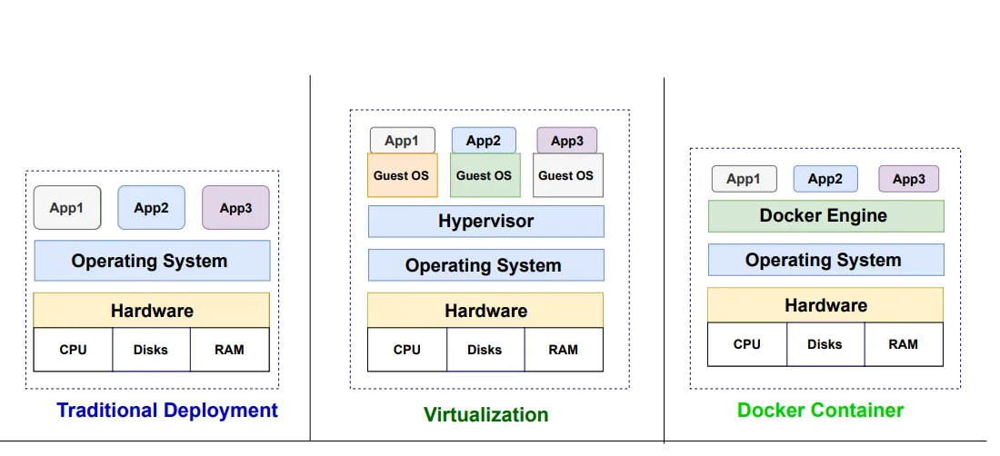

# 멀티 OS 사용을 위한 가상화 환경 구축 Guide

## virtualization
  - 하나의 OS나 하나의 시스템에서만 작업하는것이 아니라 다양한 플랫폼과 운영 체제, 개발 운영 환경을 사용하고 있다.
  - 이렇게 멀티 플랫폼이나 개발 및 운영 환경을 구축하기 위해서 물리적인 시스템을 도입하는 것은 경제적으로나 시간적으로 제약이 따를 수 밖에 없는데, 실제로 사용하려던 환경을 물리적인 시스템을 도입하지 않더라도 하나의 시스템이 가지고 있는 환경이나 리소스를 분할해서 사용하는 개념이 가상화 환경 Virtualization 이라 할 수 있다. 

## 프로젝트 학습 목적
  - 이러한 가상화 환경 구축을 위해 필요한 기본적인 개념 및 소프트웨어에 설치하고 사용 방법에 대해 알아본다.

## Virtualization 이란?

### Virtualization(가상화)
  - 하나의 물리적인 머신에서 여러 개의 운영체제를 실행

### 클라우드 컴퓨팅에서의 가상화
  - 운영 체제(os) 내에 가상 머신을 생성하는 하드웨어 가상화

### 가상화의 장점
  - 유연성: 동일한 하드웨어에서 여러 운영체제를 동시에 실행
  - 민첩성: 여러 운영체제 간의 파일 이동
  - 내결함성: 서버에 장애가 발생할 경우 서비스 및 소프트웨어는 이용 가능한 다른 서버로 이전 가능
  - 비용절감: 물리적 서버의 수를 즐이고, 서버의 자원을 재분배 및 재사용 가능

### 가상화 구성도
[reference](https://medium.com/@mrdevsecops/traditional-deployment-vs-virtualization-vs-container-f9b82ce98a50)

## VirtualBox
- 가상화 인스턴스
- [VirtualBox](https://www.virtualbox.org/)
### 설치
- [설치](https://www.virtualbox.org/wiki/Downloads)

## Vagrant
- virtualBox, vmWare, Hyper-v 등을 관리할 수 있는 가상화 인스턴스 관리 SW(Provisioning)
- 설정 스크립트를 기반으로 특정 환경의 가상머신을 생성(버전관리 )
- 개발 환경 공유
- Ruby로 개발되었으며, Linux, FreeBDS, OSX, Windows 지원
### Provisioning
- IT 인프라를 생성, 설정하는 프로세스
- 다양한 리소스에 대한 사용자 및 시스템 액세스를 관리하는데 필요한 단계 포함
- 사용자의 요구에 맞게 시스템 자원을 할당, 배치, 배포 -> 필요시 시스템을 즉시 사용할 수 있는 상태로 미리 준비

### 설치
- [vagrant](https://www.vagrantup.com/)
- [vagrant brew](https://formulae.brew.sh/cask/vagrant)

### guide & boxes cloud page
- [vagrant doc](https://developer.hashicorp.com/vagrant/docs)
- [vagrant cloud](https://app.vagrantup.com/boxes/search)

## Vagrant 사용
- [Vagrant 를 이용하여 VM 제어하기](/01_how-to-control-vm-via-vagrant/README.md)